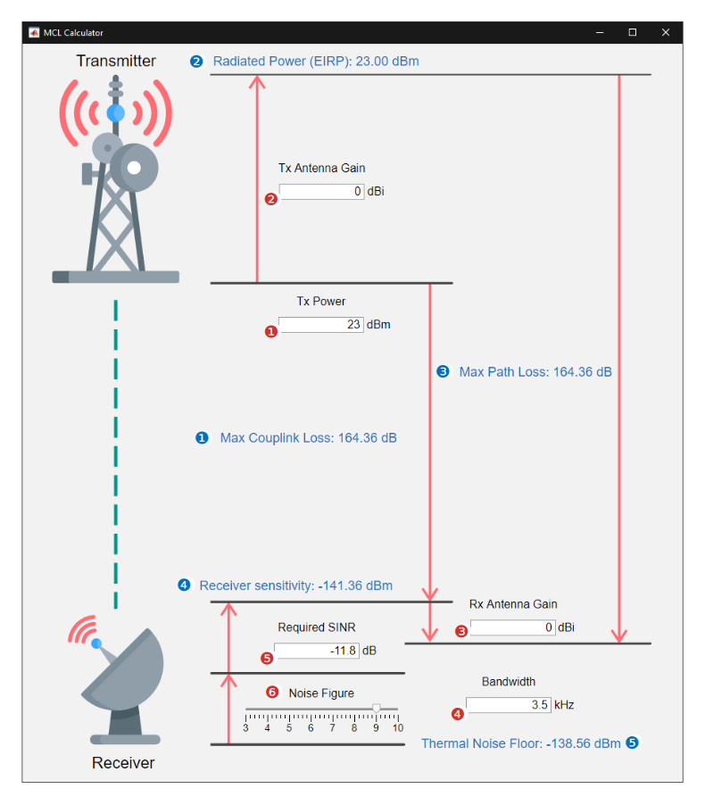

# MCL Calculator

## Main Functionality
The application calculates MCL (Maximum Coupling Loss, MPL (Maximum Path-Loss), Receiver Sensitivity, and Thermal Noise Floor of the communication technology. The Thermal Noise Floor calculation is simplified based on the formula for room temperature cases, e.g., -174 dBm/Hz.

The red circle parameters are input values and can be changed, whereas the blue circles denote the derived values with informational character. When the input parameter is altered, and the value is confirmed by pressing the Enter key, the output parameters are automatically recalculated.

### Input Parameters
1. *Transmitter power* in dBm.
2. *Transmitter antenna gain* in dBi.
3. *Receiver antenna gain* in dBi.
4. *Bandwith* of the signal carrier in kHz. This is the only value controlling the Thermal Noise Floor.
5. *Required SINR* (Signal to Interference plus Noise Ratio) value on the receiving side. For LTE (Long Term Evolution) systems, the lowest permissible value for Quadrature Phase Shift Keying (QPSK) modulation is -6.7 dB. In the case of NB-IoT technology with π/2-BPSK (Binary Phase Shift Keying) modulation, the SINR can be as low as -11.8 dBm.
6. *Noise Figure* of the receiver amplifier. This value is dependent on the quality LNA (Low Noise Amplifier) embedded in the communication module. However, 3GPP proposes two Noise Figure values that can be considered for the typical UE (User Equipment). For the conservative prediction (TR 36.888), it is value **9**. In the case of a less conservative scenario, the standard (TR 45.820) suggests value **5**.

### Output Parameters
1. *Maximum Coupling Loss* in dB. Defines the maximal channel loss between the transmitter and receiver without the additional loss/gain caused by the cables or antennas.
2. *Equivalent Isotropically* Radiated Power in dBm. Combines a value of transmitted power with transmitter antenna gain.
3. *Maximum Path-Loss* in dB. Basically, its value is derived as MCL with additional antenna gains.
4. *Receiver Sensitivity* in dBm. Below this threshold, the module can not receive and decode the signal.
5. *Thermal Noise Floor* in dBm. It is a noise that is a result of the thermal agitation of electrons. The thermal noise power depends on the bandwidth and temperature of the surroundings. In this calculation, the temperature is considered as 300K.
